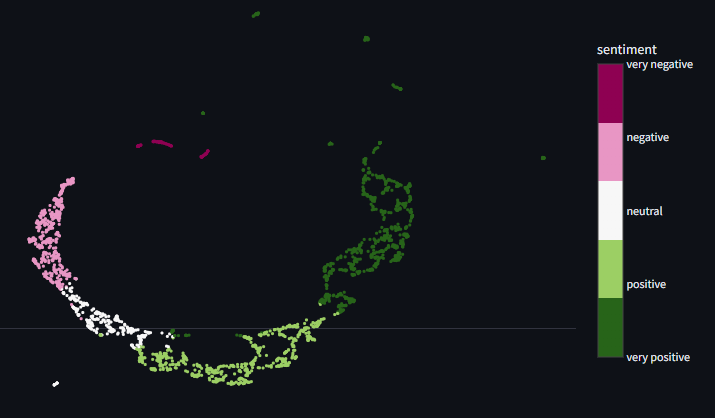
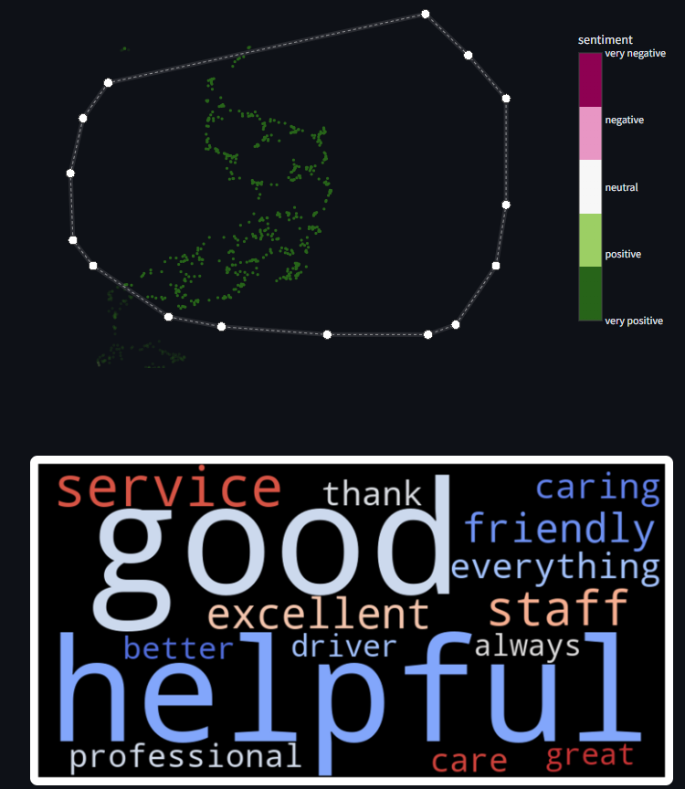
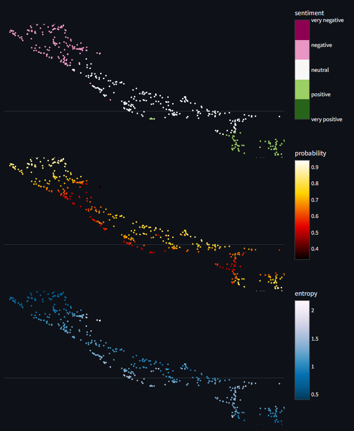
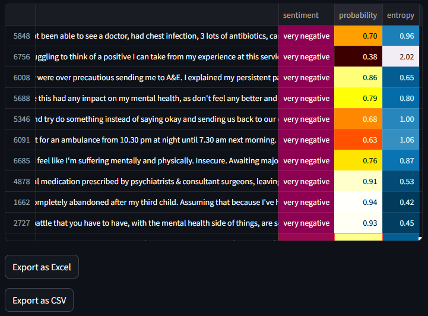

# nhs_fft_explorer_app
Interactive desktop app for visually exploring themes and sentiment in NHS FFT feedback. User can also export the results for further quantitative analysis using their preferred BI tool.


## Demo


## Usage overview
Visualise the relationship between samples:


Generate word embeddings of interesting clusters:


Look at the  model's confidence and how mixed the prediction is (entropy):


Export annotated tables to CSV and Excel, ready for use with BI tools:


## Running the app
In each case below, point your browser to `http://localhost:8501` to view the app.

### Directly from a Python environment
Install the `requirements.txt` file using `pip` or set up an equivalent environment.

Launch the app using `streamlit run streamlit_app.py`

### Build and run using Docker
Build the Docker file using `docker build . -t fft_explorer_app`.

Launch the app using `docker run -p 8501:8501 fft_explorer_app:latest`

The resulting image is around 5GB in size.

### PyInstaller for deploying a platform-independent app
The user will need an installation of Docker Desktop.

Save the Docker image out using
```docker save -o fft_explorer_app.tar fft_explorer_app:latest```

The tarball is around 1GB.

Compile the app on your target platform (Windows, Mac, or Linux); for Linux I use:
```pyinstaller --onefile --add_data "data:data" --add-data "fft_explorer_image.tar:." app_launcher.py```

The compiled version will internally invoke `app_launcher.py` which loads the Docker image and starts a container.

The `--onefile` switch is option, used for compiling into a single file rather than a folder.

## Technical summary
Frontend
 - Streamlit UI with Plotly interactive figures

Backend
 - Fine-tuned TinyBERT LLM optimized for both speed on regular desktops and good performance on sentiment analysis

Deployment
 - Easy click-to-launch app
 - Internally uses Docker and PyInstaller for simple multi-platform deployment to any desktop computer
